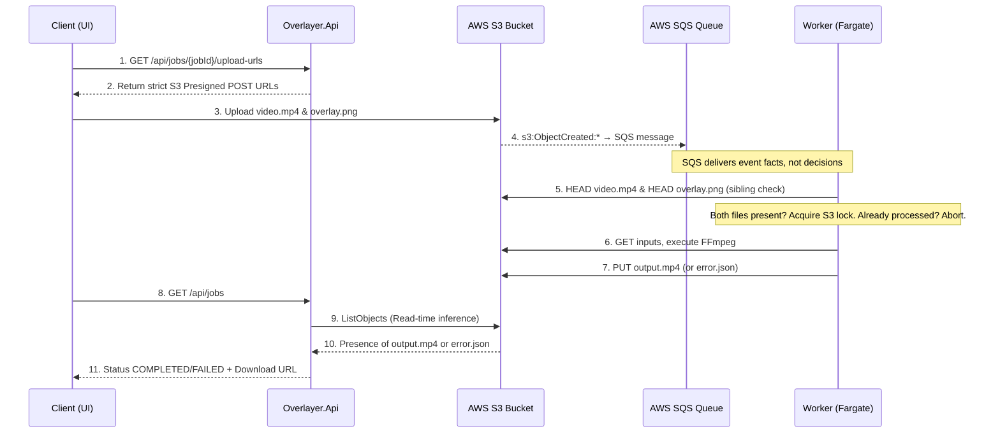

# Overlayer Architecture

This document synthesizes the architectural design, service boundaries, and testing strategies for the Overlayer background render pipeline.

## 1. Core Architecture Premise

Overlayer is a stateless, event-driven video processing pipeline demonstrating production-grade AWS architecture. It allows anonymous users to upload a video and a custom overlay, delegates compute-heavy FFmpeg rendering asynchronously, and handles state delivery without persistent databases or orchestration layers.

**Key Design Decisions:**

- **S3 as the State Machine:** The system contains zero relational databases. S3 acts as both storage and state store. Job state (`MISSING_ASSETS`, `PROCESSING`, `COMPLETED`, `FAILED`) is inferred at read-time based on S3 object presence and prefix structure.
- **Anonymous Session Isolation:** Authentication overhead is avoided. The client generates a UUID (`X-Session-ID`) attached to all API requests and S3 path prefixes.
- **Edge-Enforced Ingest:** Application compute sits safely behind AWS edge policies. The .NET API generates strict S3 Presigned POST URLs incorporating size limitations (`content-length-range`) and correct content types.
- **Worker Owns All Logic:** The AWS Fargate worker is the single decision point in the pipeline. It validates file readiness, acquires a distributed lock, checks idempotency, and executes the render. There is no orchestration layer between S3 and the worker.

### Architecture Event Flow

The following sequence outlines the system's asynchronous, database-free execution cycle:



---

## 2. Component Topology

The system is compartmentalized into discrete .NET 10 components, each with specific operational and architectural bounds:

### 2.1 Backend (.NET 10)

- **`Overlayer.Shared` (Class Library)**
  - **Role:** The single source of truth for the system's domain. Contains POCOs, Request/Response DTOs, S3 prefix constants, and Enums.
  - **Tech Stack:** .NET 10, C#.
  - **Dependencies:** None (Pure C#).
- **`Overlayer.Api` (Web API)**
  - **Role:** The frontend's entry point. Generates Presigned URLs for S3 uploads and reconciles job status on the fly by reading S3 prefixes.
  - **Tech Stack:** .NET 10, C#, Minimal APIs.
  - **Hosting:** AWS Lambda via `AWS.Lambda.AspNetCoreServer.Hosting`.
  - **Dependencies:** `Overlayer.Shared`, `AWSSDK.S3`.
- **`Overlayer.Worker` (Console App)**
  - **Role:** The compute engine and single decision point. Dequeues SQS messages, validates that both files exist in S3 (sibling check), acquires an S3 conditional write lock to prevent concurrent processing of the same job, checks idempotency, executes FFmpeg, and uploads the result.
  - **Tech Stack:** .NET 10, C#.
  - **Hosting:** Fargate (Docker).
  - **Dependencies:** `Overlayer.Shared`, `AWSSDK.S3`, `AWSSDK.SQS`, FFmpeg binary (installed via Dockerfile).

### 2.2 Frontend Shell (Astro + React)

- **Role:** The client interface. Uploads directly to S3 and queries the API for status updates. Interactivity is bounded to a React Island representing the canvas editor.
- **Tech Stack:** Astro, React, TypeScript.

---

## 3. The API Contract

Overlayer relies upon stateless HTTP interaction requiring specific headers for session boundaries (`X-Session-ID`):

- **`GET /api/jobs/{jobId}/upload-urls`**: Requests S3 Presigned credentials.
- **`GET /api/jobs`**: Reconciles the directory tree on the fly to return user jobs and their calculated execution states.

_All endpoints return standardized error shapes using the HTTP Problem Details standard natively supported by ASP.NET Core. Refer to [contract.md](contract.md) for exact schemas._

---

## 4. Worker Algorithm

The worker is the sole decision engine. Every SQS message triggers the following sequence:

```
Parse message → (sessionId, jobId)

videoKey   = jobs/{sessionId}/{jobId}/video.mp4
overlayKey = jobs/{sessionId}/{jobId}/overlay.png
outputKey  = outputs/{sessionId}/{jobId}/output.mp4

// 1. Idempotency - skip already-completed jobs
if (Exists(outputKey))
    return;

// 2. Readiness check - wait for sibling file
if (!Exists(videoKey) || !Exists(overlayKey))
    return;

// 3. Acquire lock via S3 conditional write (atomic)
//    PUT locks/{sessionId}/{jobId}.lock  If-None-Match: *
if (!TryAcquireLock(sessionId, jobId))
    return;

// 4. Execute render
Process(videoKey, overlayKey, outputKey);

// 5. Mark completion
CreateDoneMarker(sessionId, jobId);
```

---

## 5. Software Boundaries and Directory Structure

Following Outside-In Test-Driven Development, the solution separates production `src/` from test `tests/` code. This allows for executing all layers of the TDD strategy smoothly.

### Solution Folder Mapping

```text
├── docs/
├── infra/                              # Pulumi Infrastructure as Code
├── src/
│   └── backend/
│       ├── Overlayer.Shared/
│       ├── Overlayer.Api/
│       └── Overlayer.Worker/
│
└── tests/
    ├── Overlayer.TestSupport/          # Shared test utilities (LocalStack, WireMock helpers)
    ├── Overlayer.Api.Tests/
    └── Overlayer.Worker.Tests/
```

### Testing Strategy

- **API Layer**: Utilises `WebApplicationFactory` for robust acceptance testing inside the boundary, and mocks `AWSSDK.S3` interfaces to validate complex status inference and URL logic during unit tests.
- **Worker Layer**: Drives integration tests with LocalStack (S3 + SQS) to simulate end-to-end event flow. Unit tests cover the sibling check algorithm, S3 lock strategy, idempotency logic and FFmpeg command builder.

_Refer to [`tdd-strategy.md`](tdd-strategy.md) for in-depth testing mechanics of the project hierarchy._
